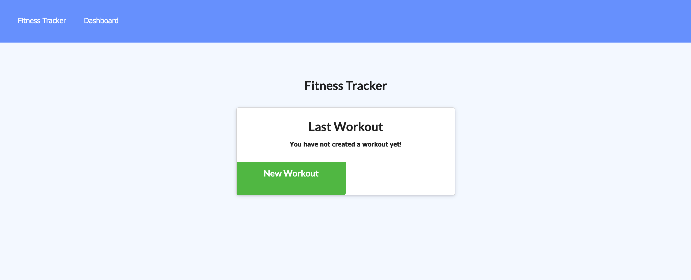
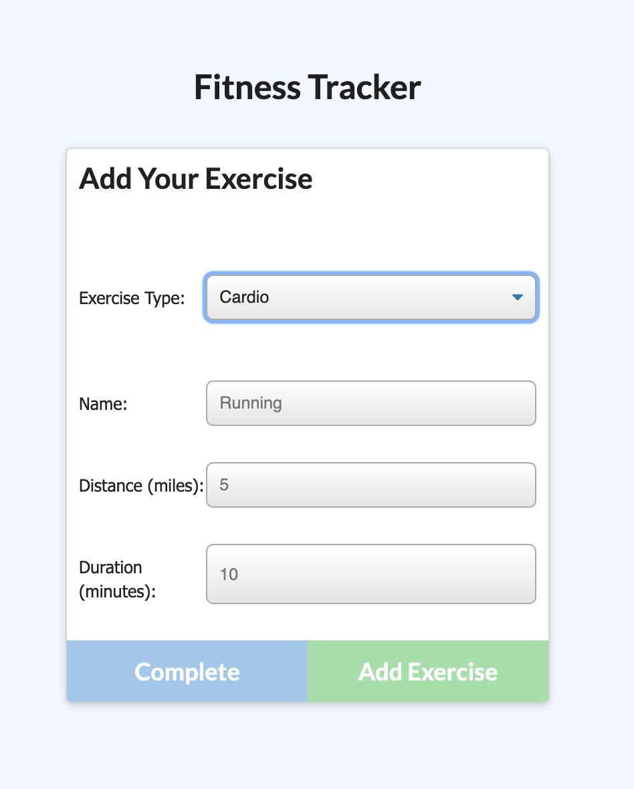
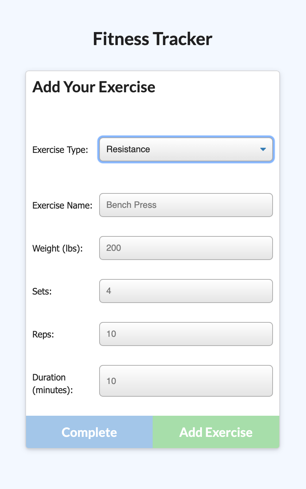
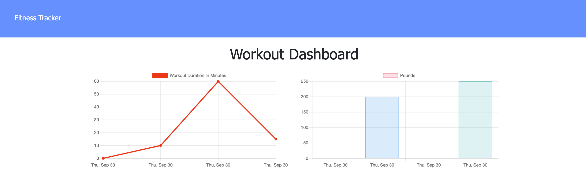

# Workout Tracker App

## Description

This web-app allows the user to track workouts and exercises.

## Instructions
1. Select New Workout
2. Select Cardio or Resistance
3. Fill out the form
4. Submit when finished

## Technologies

* [Node.JS](https://nodejs.org/en/docs/)
* [express](https://www.npmjs.com/package/express)
* [mongoose](https://www.npmjs.com/package/mongoose)
* [morgan](https://www.npmjs.com/package/morgan)

## Links
[Repo](https://github.com/webdev410/workout-tracker-app)

[Deployed](https://mongoose-workout-plan.herokuapp.com/?id=614dab8b37b46e00166e4b08)

[My GitHub](https://github.com/webdev410)

For questions, please email webdev410@gmail.com

## Screenshots
### Homepage

### Add Exercise

### Dashboard
